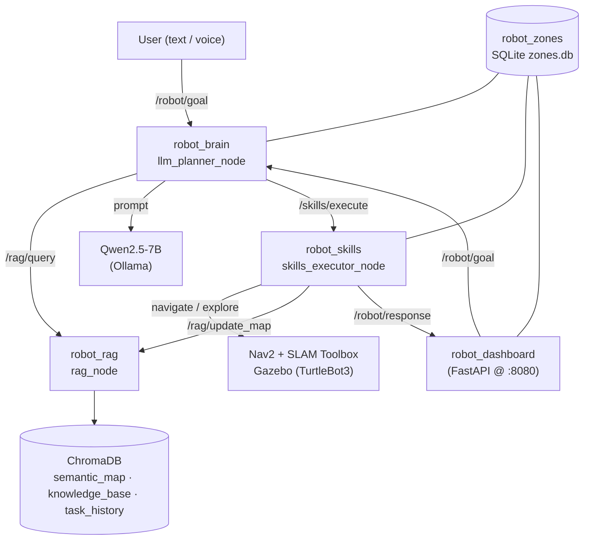

# Robot RAG Agent

A cognitive agent for a mobile robot (TurtleBot3) running in simulation
(ROS 2 Jazzy + Gazebo Harmonic). It takes natural-language goals, consults a
semantic memory (RAG over ChromaDB), plans with a local LLM (Qwen2.5-7B via
Ollama), and executes the plan through ROS 2 skills (navigation, exploration,
perception, reporting). A FastAPI dashboard gives live observability, an
interactive SLAM map, and text/voice goal input.

[](https://github.com/Diegomartinezpuertas/roboRAG/actions/workflows/ci.yml)


> Personal portfolio project. Documentation is treated as first-class: every
> significant decision is recorded as an ADR in [`docs/decisions/`](docs/decisions).
> Built with Claude Code as a pair programmer — [what that means here](#how-this-was-built).

---

## Does the RAG actually help? (measured)

The central question of this project is whether semantic memory (RAG) improves
natural-language navigation. Rather than assert it, it is **measured** with an
ablation: the same tasks are run with RAG on and off, and the planner's
decision is scored. The measurement is at the **planning level** (does the
robot decide to navigate directly to a remembered location, vs. explore
blindly) — this is the causal mechanism of the hypothesis, and it is
reproducible (`temperature=0`), unlike end-to-end navigation on this
software-rendered WSL2 sim (see [ADR-013](docs/decisions/ADR-013-planning-level-benchmark.md)).

**Result** (`eval/tasks_full.yaml`, 42 runs):

| Task type | With RAG | Without RAG |
|---|---|---|
| Object-referenced nav (RAG-dependent) | **9/9 (100%)** | **0/9 (0%)** |
| Description-referenced nav (self-built memory) | **6/6 (100%)** | **0/6 (0%)** |
| Known-zone nav (control) | 3/3 (100%) | 3/3 (100%) |
| Impossible goal (hallucination check) | 3/3 (100%) | 3/3 (100%) |


More measured findings (full data and charts in
[docs/rag-analysis.md](docs/rag-analysis.md)):

- **Phrasing/language robustness** (36 runs): retrieval survives Spanish
  paraphrases and English goals — 18/18 direct-nav with RAG (with the bge-m3
  embedder) vs 0/18 without.
- **The embedding model is a real multilingual bottleneck**: with Spanish
  queries over English memories, nomic-embed-text ranks the right document
  first only **43%** of the time (negative separation margin), while
  **bge-m3 reaches 86%** with a positive margin — both stay 100% in English.
  bge-m3 is the project default as a result.
- **RAG's latency cost is measurable but small**: 2.2 s vs 1.8 s mean
  goal→plan (three collection retrievals with bge-m3), dwarfed by LLM
  inference either way.


How to read this:

- **Object-referenced** ("go to *estacion_a*"): RAG makes the difference. With
  it the planner retrieves the coordinates and navigates directly; without it,
  it has nothing to go on and falls back to exploring.
- **Description-referenced** ("go to the white, open room"): the memory is
  **self-built** — the robot stores a scene description (dominant colours +
  LIDAR clutter, no ML) of every place it reaches while exploring. Several
  areas can match, so the scorer accepts any retrieved area whose stored text
  matches the requested attributes.
- **Known zone** (a plain SQLite table): both conditions succeed. This control
  shows the ablation isolates RAG's *object memory* — when the information is
  available another way, RAG is not needed.
- **Impossible goal** ("the garage", which does not exist): neither condition
  invents coordinates.

The planning suites reproduce **without a simulator**, with only Ollama
running ([ADR-020](docs/decisions/ADR-020-offline-benchmark-seeding.md)).
[docs/EVALUATION.md](docs/EVALUATION.md) reproduces every number;
[docs/rag-analysis.md](docs/rag-analysis.md) is the full interpretation;
[docs/rag-pipeline.md](docs/rag-pipeline.md) explains what the memory stores
and how it retrieves.

---

## Architecture



| Package | Role |
|---------|------|
| `robot_interfaces` | Custom messages/services (`QueryRAG`, `ExecuteSkill`, `UpdateMap`, `SemanticObject`) |
| `robot_rag` | ChromaDB-backed semantic memory + RAG query service |
| `robot_skills` | Executable skills: navigate (Nav2), explore (frontier, self-building memory), perceive (scene descriptor), scan_360 (in-place panoramic sweep), report |
| `robot_brain` | LLM planner: RAG retrieval → Qwen plan → skill dispatch → post-execution report |
| `robot_zones` | Shared SQLite store of user-defined named zones |
| `robot_dashboard` | Web dashboard: observability, interactive SLAM map, text/voice goals |
| `robot_bringup` | Launch files and configuration for the whole system |

---

## The cognitive loop

1. A goal arrives on `/robot/goal` (typed, spoken via the dashboard, or `ros2 topic pub`).
2. `llm_planner_node` retrieves relevant context from the three RAG collections
   (dropping low-relevance hits below a similarity threshold) and the known zones.
3. Qwen2.5-7B produces a JSON plan. If retrieved context contains coordinates,
   it navigates directly; otherwise it explores.
4. Skills execute in sequence via `/skills/execute`. The memory is
   **self-building**: every place reached while exploring is described
   (dominant colors + LIDAR clutter) and stored with its coordinates, so
   goals like "go to the white, open room" resolve later without seeding.
5. A **second** LLM call summarizes the *actual* results (grounded, in the
   user's language) and publishes it to `/robot/response`.

---

## Quickstart

### Verify it works, without installing anything

Everything that does not need a simulator or a GPU — the build, the linter and
both test layers — runs in a container
([ADR-021](docs/decisions/ADR-021-container-reproducibility.md)). No ROS 2, no
Python, no GPU on your machine:

```bash
docker build -t robot-rag-agent .
docker run --rm robot-rag-agent
```

Expected: `ruff` clean, **124** + **21** tests, exit `0`. The image sources the
project's own `setup_env.sh` and runs at `/robot_ws`, which also exercises the
path-portability fix ([ADR-015](docs/decisions/ADR-015-workspace-relative-paths.md)).

The simulator is not in the image — Gazebo already renders on `llvmpipe` here
and a containerised copy would only be slower. `.devcontainer/` opens the same
image in VS Code.

### Run the real thing

Requires ROS 2 Jazzy, Gazebo Harmonic, and Ollama with `qwen2.5:7b` and
`bge-m3` pulled. See
[`CLAUDE.md`](CLAUDE.md) for the full environment (WSL2 + venv bridge).

The workspace is not pinned to a fixed location: `setup_env.sh` derives its own
directory and exports it as `ROBOT_WS`, which every node uses to build its
default data paths. Clone it wherever you like.

```bash
# Prepare the shell (sources ROS 2, exports ROBOT_WS, bridges the venv via
# PYTHONPATH — ADR-003)
source <your-clone>/setup_env.sh

# Build
cd "$ROBOT_WS" && colcon build --symlink-install

# Launch everything: Gazebo + Nav2 + SLAM + agent + dashboard + RViz
ros2 launch robot_bringup full_system.launch.py

# Send a goal
ros2 topic pub --once /robot/goal std_msgs/String "data: 'Explora el entorno durante 60 segundos'"

# Dashboard (open in the Windows browser): http://localhost:8080
# Binds loopback only — the API is unauthenticated. WSL2's localhost relay
# forwards into the VM, so the Windows browser reaches it regardless.
```

---

## Testing & CI

Three layers, split by what each needs to run
([ADR-018](docs/decisions/ADR-018-test-strategy.md)):

| Layer | Covers | Needs | Tests | Run |
|---|---|---|---|---|
| Pure logic | chunking, plan parsing, prompts, frontier selection, scene descriptor, zone store, HTTP layer, benchmark scorer | nothing | 124 | `pytest tests/` |
| Node level | real services on real executors, the HTTP↔ROS bridge, the shutdown contract of every node ([ADR-016](docs/decisions/ADR-016-node-shutdown-contract.md)) | ROS 2 | 21 | `PYTEST_DISABLE_PLUGIN_AUTOLOAD=1 colcon test` |
| Manual | navigation, exploration, perception, the LLM calls | Gazebo + Ollama | — | see [Limitations](#limitations) |

The env var is required: Jazzy's `launch_testing` pytest plugin breaks
collection on current pytest. Lint is `ruff check .`
([ADR-017](docs/decisions/ADR-017-single-linter-ruff.md)). CI runs layer 1 on
a plain runner and layer 2 in `ros:jazzy-ros-base`, on every push.

---

## Tech stack

| Layer | Choice |
|-------|--------|
| Middleware | ROS 2 Jazzy, CycloneDDS (pinned to loopback for WSL2, [ADR-006](docs/decisions/ADR-006-cyclonedds-loopback.md)) |
| Simulation | Gazebo Harmonic, TurtleBot3 Waffle |
| Navigation | Nav2 (SimpleCommander) + SLAM Toolbox ([ADR-004](docs/decisions/ADR-004-slam-toolbox-no-amcl.md)) |
| Planner LLM | Qwen2.5-7B via Ollama (`temperature=0`) |
| Perception | Classical scene descriptor — camera colors + LIDAR clutter, no ML ([ADR-014](docs/decisions/ADR-014-classical-scene-descriptor.md)) |
| Embeddings | bge-m3 via Ollama (multilingual; chosen over nomic-embed-text on measured data) |
| Vector store | ChromaDB ([ADR-001](docs/decisions/ADR-001-chromadb.md)) |
| Dashboard | FastAPI + uvicorn, vanilla-JS SPA ([ADR-005](docs/decisions/ADR-005-dashboard-fastapi.md)) |

Design decisions are logged as [21 ADRs](docs/decisions/). Highlights:
[ADR-007](docs/decisions/ADR-007-executors-callback-groups.md) (executor/
callback-group design behind the blocking service calls),
[ADR-009](docs/decisions/ADR-009-camera-resolution-bridge.md) (a 1080p camera
silently dropping frames over DDS),
[ADR-011](docs/decisions/ADR-011-rag-quality-zones-sqlite.md) and
[ADR-012](docs/decisions/ADR-012-navigable-rag-post-execution-report.md)
(making the RAG genuinely navigable).

---

## Limitations

- **Planning-level benchmark, not physical SR/SPL.** End-to-end navigation on
  this software-rendered sim is unreliable (the robot wedges in doorways;
  `navigate` sometimes reports false success). The planning metric isolates
  the RAG mechanism reproducibly; a physical run needs better hardware.
- **The headline suite is saturated** (every cell 100% or 0%), so it cannot
  show improvement. `eval/tasks_hard.yaml` (60 runs) can: **27/30 with RAG vs
  3/30 without**, with the misses concentrated in spatial reasoning ("the
  station nearest the base", 3/6) — the target for the agent loop. Breakdown
  in [docs/rag-analysis.md §2.6](docs/rag-analysis.md).
- **RAG's value is scale-dependent.** For a handful of places a SQLite lookup
  does the job (the known-zone control shows it). RAG matters as the
  open-vocabulary memory grows.
- **Perception is attribute-level.** The descriptor characterises places
  (colours, clutter) but cannot name objects. The VLM was removed as
  unreliable on software-rendered frames
  ([ADR-014](docs/decisions/ADR-014-classical-scene-descriptor.md)).
- **Cross-lingual retrieval depends on the embedder.** nomic-embed-text: 43%
  top-1 for Spanish queries over English memories; bge-m3: 86%, and it is the
  default ([rag-analysis §2.4](docs/rag-analysis.md)).

## Roadmap

1. **Real agent loop** (replanning from execution feedback) — the jump from
   plan-then-execute to a true agent; expected benchmark improvement and a
   natural next README section.
2. **Native voice phase** (Whisper on the Windows NPU, publishing to
   `/robot/goal`) — the NPU is unreachable from WSL2, so this runs host-side.
3. **Object-level detection** (YOLOv8n; VLM revisit on real-camera hardware)
   — the classical descriptor covers place attributes, naming objects needs
   a detector.
4. **SLAM map save/load** (`map_saver_cli`) for reproducible scenarios and a
   physical SR/SPL benchmark run.
5. ~~**Docker/devcontainer** for full reproducibility.~~ **Done** —
   [ADR-021](docs/decisions/ADR-021-container-reproducibility.md). The
   remaining "works on my WSL2" caveat is now the simulator alone.

## How this was built

With [Claude Code](https://claude.com/claude-code) as the coding assistant,
which is why every commit carries its co-author line. The decisions — what to
build, what to measure, what to remove — and the hours in front of the
simulator finding the failures the ADRs record are mine; most of the typing is
Claude's. The claim this project makes is the measurement, not the code.

## License

MIT — see [LICENSE](LICENSE).
