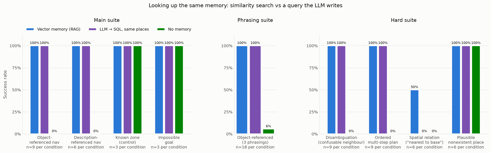

# Robot RAG Agent

A cognitive agent for a mobile robot (TurtleBot3) running in simulation
(ROS 2 Jazzy + Gazebo Harmonic). It takes natural-language goals, consults a
semantic memory (RAG over ChromaDB), plans with a local LLM (Qwen2.5-7B via
Ollama), and executes the plan through ROS 2 skills (navigation, exploration,
perception, reporting). A FastAPI dashboard gives live observability, an
interactive SLAM map, text/voice goal input, a browser of everything the robot
remembers, and WASD driving to map the house by hand first.

[](https://github.com/Diegomartinezpuertas/roboRAG/actions/workflows/ci.yml)


> Personal portfolio project. Documentation is treated as first-class: every
> significant decision is recorded as an ADR in [`docs/decisions/`](docs/decisions).
> Built with Claude Code as a pair programmer — [what that means here](#how-this-was-built).

---

## Does the RAG actually help? (measured)

> **Short answer: memory is decisive; *vector* search is not shown to be the
> only way to use it.** Asked for a remembered place by name or by description,
> the planner with the robot's memory goes straight to it 15/15; without memory
> it has nothing to go on and explores, 0/15. But an **LLM writing SQL over the
> same places** did just as well on every lookup — names, descriptions,
> Spanish and English, confusable names, multi-step plans — and lost only the
> spatial comparisons (0/6 vs 3/6), 0.6 s slower. At this memory size (a dozen
> places, a description vocabulary the SQL prompt can list), RAG is not shown to
> beat SQL; where it should — large, open-vocabulary memories — is not measured
> yet ([rag-analysis §2.10](docs/rag-analysis.md)). For places the zone table
> already names, neither adds anything (3/3 in both). And memory can mislead:
> asked for a plausible place that does not exist, the planner borrows a real
> place's coordinates unless the plan is checked before it runs (0/6 → 6/6).
>
> **What each condition is:** all use the same Qwen planner, prompt and SQLite
> zone table (names and centres, resolved by exact name). *With RAG* adds
> similarity search over the vector memory. *Without RAG* has no access to that
> memory — so it is *LLM as interpreter + SQL zones*, not a bare LLM, and it
> lacks the facts memory holds. *LLM → SQL* gives it the same places as a table
> it queries itself ([ADR-033](docs/decisions/ADR-033-llm-to-sql-place-memory.md)).

The central question of this project is whether semantic memory (RAG) improves
natural-language navigation. Rather than assert it, it is **measured** with an
ablation: the same tasks are run with RAG on and off, and the planner's
decision is scored. The measurement is at the **planning level** (does the
robot decide to navigate directly to a remembered location, vs. explore
blindly) — this is the causal mechanism of the hypothesis, and it is
repeatable (`temperature=0`; a re-run still moves a task type by a run or two),
unlike end-to-end navigation on this software-rendered WSL2 sim (see [ADR-013](docs/decisions/ADR-013-planning-level-benchmark.md)).

**Result** (`eval/tasks_full.yaml`, 42 runs, re-measured 2026-09-16, plan check on in both):

| Task type | With RAG | Without RAG |
|---|---|---|
| Object-referenced nav (RAG-dependent) | **9/9 (100%)** | **0/9 (0%)** |
| Description-referenced nav (self-built memory) | **6/6 (100%)** | **0/6 (0%)** |
| Known-zone nav (control) | 3/3 (100%) | 3/3 (100%) |
| Impossible goal (hallucination check) | 3/3 (100%) | 3/3 (100%) |


More measured findings (full data and charts in
[docs/rag-analysis.md](docs/rag-analysis.md)):

- **Phrasing/language robustness** (36 runs): retrieval survives Spanish
  paraphrases and English goals — 18/18 direct-nav with RAG (with the bge-m3
  embedder) vs 2/18 without, and those two are a fixture coincidence, not
  recall ([rag-analysis §2.2](docs/rag-analysis.md)).
- **The embedding model is a real multilingual bottleneck**: with Spanish
  queries over English memories, nomic-embed-text ranks the right document
  first only **43%** of the time (negative separation margin), while
  **bge-m3 reaches 86%** with a positive margin — both stay 100% in English.
  bge-m3 is the project default as a result.
- **RAG's latency cost is measurable but small**: median goal→plan 1.4 s
  without RAG, 2.0 s with it, 2.4 s with the plan check — dwarfed by LLM
  inference either way.
- **Memory can also mislead the planner — so plans are checked before they
  run.** Asked for *plausible* places that do not exist ("estacion_d" when a, b
  and c do; "la estación central"), the planner with RAG invented a zone or
  reused a real station's coordinates in 6 of 6 runs. A check between planning
  and execution replaces a step that goes to an unknown zone, an unknown point
  or a borrowed place with exploration: **6/6** with it, at the cost of 2 correct
  spatial answers wrongly rejected and ~0.4 s
  ([ADR-032](docs/decisions/ADR-032-plan-check-before-execution.md),
  [rag-analysis §2.9](docs/rag-analysis.md)). An example in the knowledge base
  had also overridden the prompt's "explore, don't guess" rule until a re-run
  caught it ([ADR-031](docs/decisions/ADR-031-knowledge-base-is-planner-input.md)).


**RAG vs an LLM writing SQL over the same places** (one session, one memory):



How to read this:

- **Object-referenced** ("go to *estacion_a*"): RAG makes the difference. With
  it the planner retrieves the coordinates and navigates directly; without it,
  it has nothing to go on and falls back to exploring.
- **Description-referenced** ("go to the white, open room"): the memory is
  **self-built** — the robot stores a scene description (dominant colours +
  LIDAR clutter, no ML) of every place it reaches while exploring. Several
  areas can match, so the scorer accepts any retrieved area whose stored text
  matches the requested attributes.
- **Known zone** (a plain SQLite table): both conditions succeed. This control
  shows the ablation isolates RAG's *object memory* — when the information is
  available another way, RAG is not needed.
- **Impossible goal** ("the garage", which does not exist): neither condition
  invents coordinates. That only holds while the knowledge base agrees with the
  prompt rules: a worked example saying "do not explore" dropped it to 0/3 with
  RAG until it was removed (ADR-031).

The planning suites reproduce **without a simulator**, with only Ollama
running ([ADR-020](docs/decisions/ADR-020-offline-benchmark-seeding.md)).
[docs/EVALUATION.md](docs/EVALUATION.md) reproduces every number;
[docs/rag-analysis.md](docs/rag-analysis.md) is the full interpretation;
[docs/rag-pipeline.md](docs/rag-pipeline.md) explains what the memory stores
and how it retrieves.

---

## Architecture

```mermaid
flowchart TD
    user["User (text / voice)"] -->|/robot/goal| planner
    dash["robot_dashboard<br/>(FastAPI @ :8080)"] -->|/robot/goal| planner
    dash -->|/rag/inspect · /rag/delete| rag
    dash -->|/robot/cmd_vel_manual (WASD)| mux["cmd_vel_mux_node<br/>manual over Nav2"]
    mux -->|/cmd_vel| nav2
    planner["robot_brain<br/>llm_planner_node"] -->|/rag/query| rag
    planner -->|prompt| ollama["Qwen2.5-7B<br/>(Ollama)"]
    rag["robot_rag<br/>rag_node"] --> chroma[("ChromaDB<br/>semantic_map · knowledge_base · task_history")]
    planner -->|/skills/execute| skills["robot_skills<br/>skills_executor_node"]
    skills -->|navigate / explore| nav2["Nav2 + SLAM Toolbox<br/>Gazebo (TurtleBot3)"]
    nav2 -->|/cmd_vel_nav_out| mux
    skills -->|/rag/update_map| rag
    skills -->|/robot/response| dash
    zones[("robot_zones<br/>SQLite zones.db")] --- planner
    zones --- skills
    zones --- dash
```

| Package | Role |
|---------|------|
| `robot_interfaces` | Custom messages/services (`QueryRAG`, `InspectMemory`, `DeleteMemory`, `ExecuteSkill`, `UpdateMap`, `SemanticObject`) |
| `robot_rag` | ChromaDB-backed semantic memory: query, inspection, deletion, merge-on-write, map sessions, `compact_memory` tool |
| `robot_skills` | Executable skills: navigate (Nav2), explore (frontier clusters, self-building memory), perceive (scene descriptor), scan_360 (in-place panoramic sweep), report; plus `cmd_vel_mux_node`, the single owner of `/cmd_vel` |
| `robot_brain` | LLM planner: RAG retrieval → Qwen plan → skill dispatch → post-execution report |
| `robot_zones` | Shared SQLite store of user-defined named zones, and what each kind of room is *for* ([ADR-022](docs/decisions/ADR-022-room-semantics.md)) |
| `robot_dashboard` | Web dashboard laid out as a live floor plan: SLAM map, text/voice goals, the agent's reasoning, RAG memory viewer, WASD driving with sim-speed and focus diagnostics |
| `robot_bringup` | Launch files (full system, demo, saved maps, memory session per map frame) and configuration |

---

## The cognitive loop

1. A goal arrives on `/robot/goal` (typed, spoken via the dashboard, or `ros2 topic pub`).
2. `llm_planner_node` retrieves relevant context from the three RAG collections
   (dropping low-relevance hits below a similarity threshold) and the known zones.
3. Qwen2.5-7B produces a JSON plan. If retrieved context contains coordinates,
   it navigates directly; otherwise it explores.
4. **The plan is checked before the robot moves.** Every `navigate` must go to a
   zone that exists or a place the robot actually knows, and a remembered place
   must not stand in for one the goal asks for that memory does not have — a
   step that fails becomes `explore`, and the user is told why
   ([ADR-032](docs/decisions/ADR-032-plan-check-before-execution.md)).
5. Skills execute in sequence via `/skills/execute`. The memory is
   **self-building**: every place reached while exploring is described
   (dominant colors + LIDAR clutter) and stored with its coordinates, so
   goals like "go to the white, open room" resolve later without seeding.
6. A final LLM call summarizes the *actual* results (grounded, in the
   user's language) and publishes it to `/robot/response`.

Before any of that, a person can drive the robot around with **WASD** in the
dashboard, name each room as they pass through it, and save the map. A zone
named after a room is indexed with what that room is *for*, in Spanish and
English — which is what makes **"ve donde se suele cocinar"** find the kitchen
rather than the nearest landmark ([ADR-022](docs/decisions/ADR-022-room-semantics.md),
measured: top-1 55% → 100% in [rag-analysis §2.7](docs/rag-analysis.md)). What
the memory holds at any moment is visible in the dashboard's memory panel,
including the coordinates each memory was learned at
([ADR-024](docs/decisions/ADR-024-memory-inspection-service.md)).

---

## Quickstart

### Verify it works, without installing anything

Everything that does not need a simulator or a GPU — the build, the linter and
both test layers — runs in a container
([ADR-021](docs/decisions/ADR-021-container-reproducibility.md)). No ROS 2, no
Python, no GPU on your machine:

```bash
docker build -t robot-rag-agent .
docker run --rm robot-rag-agent
```

Expected: `ruff` clean, **363** + **28** tests, exit `0`. The image sources the
project's own `setup_env.sh` and runs at `/robot_ws`, which also exercises the
path-portability fix ([ADR-015](docs/decisions/ADR-015-workspace-relative-paths.md)).

The simulator is not in the image — Gazebo already renders on `llvmpipe` here
and a containerised copy would only be slower. `.devcontainer/` opens the same
image in VS Code.

### Run the real thing

Requires ROS 2 Jazzy, Gazebo Harmonic, and Ollama with `qwen2.5:7b` and
`bge-m3` pulled. See
[`CLAUDE.md`](CLAUDE.md) for the full environment (WSL2 + venv bridge).

The workspace is not pinned to a fixed location: `setup_env.sh` derives its own
directory and exports it as `ROBOT_WS`, which every node uses to build its
default data paths. Clone it wherever you like.

```bash
# Prepare the shell (sources ROS 2, exports ROBOT_WS, bridges the venv via
# PYTHONPATH — ADR-003)
source <your-clone>/setup_env.sh

# Build
cd "$ROBOT_WS" && colcon build --symlink-install

# Launch everything: Gazebo + Nav2 + SLAM + agent + dashboard + RViz
ros2 launch robot_bringup full_system.launch.py

# ...or map the house by hand first: drive with WASD, name each room with
# "Nombrar esta habitación", then "Guardar mapa" as `house` — ADR-023. Manual
# driving outranks Nav2 (ADR-029); use_nav2:=false keeps Nav2 out of a mapping run
ros2 launch robot_bringup full_system.launch.py use_nav2:=false

# ...then start from that map instead of an empty one — ADR-026
ros2 launch robot_bringup full_system.launch.py saved_map:=house

# The demo setup: Gazebo window + RViz + dashboard, starting from map `house`.
# The repository does not ship that map yet: save yours as `house` first (above),
# or the launch stops with "No saved map". The Gazebo window costs some
# real-time factor on WSL2 (measured ~0.68 -> ~0.59)
ros2 launch robot_bringup demo.launch.py

# Send a goal
ros2 topic pub --once /robot/goal std_msgs/String "data: 'Explora el entorno durante 60 segundos'"

# Dashboard (open in the Windows browser): http://localhost:8080
# Binds loopback only — the API is unauthenticated. WSL2's localhost relay
# forwards into the VM, so the Windows browser reaches it regardless.
```

---

## Testing & CI

Three layers, split by what each needs to run
([ADR-018](docs/decisions/ADR-018-test-strategy.md)):

| Layer | Covers | Needs | Tests | Run |
|---|---|---|---|---|
| Pure logic | chunking, plan parsing, prompts, frontier clusters, scene descriptor, scene merging, knowledge-base sync, plan check, SQL place memory, zone store, room semantics, teleop deadman, cmd_vel mux, sim speed, saved maps and sessions, HTTP layer, the dashboard page in headless Chromium, benchmark scorer | nothing (Chromium for the page tests) | 363 | `pytest tests/` |
| Node level | real services on real executors, the HTTP↔ROS bridge (goals, driving, memory), the shutdown contract of every node ([ADR-016](docs/decisions/ADR-016-node-shutdown-contract.md)) | ROS 2 | 28 | `PYTEST_DISABLE_PLUGIN_AUTOLOAD=1 colcon test` |
| Manual | navigation, exploration, perception, the LLM calls | Gazebo + Ollama | — | see [Limitations](#limitations) |

The env var is required: Jazzy's `launch_testing` pytest plugin breaks
collection on current pytest. Lint is `ruff check .`
([ADR-017](docs/decisions/ADR-017-single-linter-ruff.md)). CI runs layer 1 on
a plain runner and layer 2 in `ros:jazzy-ros-base`, on every push.

---

## Tech stack

| Layer | Choice |
|-------|--------|
| Middleware | ROS 2 Jazzy, CycloneDDS (pinned to loopback for WSL2, [ADR-006](docs/decisions/ADR-006-cyclonedds-loopback.md)) |
| Simulation | Gazebo Harmonic, TurtleBot3 Waffle |
| Navigation | Nav2 (SimpleCommander) + SLAM Toolbox ([ADR-004](docs/decisions/ADR-004-slam-toolbox-no-amcl.md)) |
| Planner LLM | Qwen2.5-7B via Ollama (`temperature=0`) |
| Perception | Classical scene descriptor — camera colors + LIDAR clutter, no ML ([ADR-014](docs/decisions/ADR-014-classical-scene-descriptor.md)) |
| Embeddings | bge-m3 via Ollama (multilingual; chosen over nomic-embed-text on measured data) |
| Vector store | ChromaDB ([ADR-001](docs/decisions/ADR-001-chromadb.md)) |
| Dashboard | FastAPI + uvicorn, vanilla-JS SPA ([ADR-005](docs/decisions/ADR-005-dashboard-fastapi.md)) |

Design decisions are logged as [33 ADRs](docs/decisions/). Highlights:
[ADR-007](docs/decisions/ADR-007-executors-callback-groups.md) (executor/
callback-group design behind the blocking service calls),
[ADR-009](docs/decisions/ADR-009-camera-resolution-bridge.md) (a 1080p camera
silently dropping frames over DDS),
[ADR-011](docs/decisions/ADR-011-rag-quality-zones-sqlite.md) and
[ADR-012](docs/decisions/ADR-012-navigable-rag-post-execution-report.md)
(making the RAG genuinely navigable),
[ADR-022](docs/decisions/ADR-022-room-semantics.md) (rooms findable by what
they are for, measured 55% → 100%),
[ADR-031](docs/decisions/ADR-031-knowledge-base-is-planner-input.md) (a re-run
that caught a knowledge-base regression, and the claim it withdrew),
[ADR-032](docs/decisions/ADR-032-plan-check-before-execution.md) (checking plans
before the robot moves — and a variant that was measured and reverted),
[ADR-033](docs/decisions/ADR-033-llm-to-sql-place-memory.md) (RAG measured against
an LLM writing SQL over the same memory — a tie on every lookup).

---

## Limitations

- **Planning-level benchmark, not physical SR/SPL.** End-to-end navigation on
  this software-rendered sim is unreliable (the robot wedges in doorways;
  `navigate` sometimes reports false success). The planning metric isolates
  the RAG mechanism reproducibly; a physical run needs better hardware.
- **The headline suite is saturated** (every cell 100% or 0%), so it cannot
  show improvement. `eval/tasks_hard.yaml` can: **23/30 with RAG and the plan
  check**, 19/30 with the check off, 6/30 without RAG. Disambiguation is solved
  (9/9) and plausible nonexistent places are held by the check (6/6, 0/6
  without it). **Spatial reasoning is the open gap**: with every coordinate in
  the prompt, the planner picked the right station in all 6 plans in one
  session and the wrong one in all 6 in the next. Breakdown in
  [docs/rag-analysis.md §2.6](docs/rag-analysis.md).
- **The plan check is itself a model call.** It narrows the unsafe case the
  benchmark found; it does not certify a plan. It wrongly rejected 2 correct
  answers and let one fixture coincidence through
  ([ADR-032](docs/decisions/ADR-032-plan-check-before-execution.md)).
- **Totals differ between sessions by two or three runs** even with identical
  code (`temperature=0` is repeatable, not exact). Effects are claimed only
  from conditions compared within one session.
- **The numbers belong to the knowledge files they were measured with.** The
  worked examples in `data/knowledge/` are part of the prompt, and one of them
  cost a control 3/3 → 0/3. A July claim that RAG *suppresses* hallucination
  did not survive the re-run and was withdrawn
  ([rag-analysis §2.8](docs/rag-analysis.md),
  [ADR-031](docs/decisions/ADR-031-knowledge-base-is-planner-input.md)).
- **RAG's value over SQL is not shown at this size.** For a handful of places a
  SQLite lookup does the job (the known-zone control), and an LLM writing SQL
  over the same memory matched RAG on every lookup — with 8–12 places and a
  vocabulary its prompt lists, and one prompt example that also appears in a
  suite goal (disclosed in [ADR-033](docs/decisions/ADR-033-llm-to-sql-place-memory.md)).
  RAG should matter as the open-vocabulary memory grows; that is not measured.
- **Perception is attribute-level.** The descriptor characterises places
  (colours, clutter) but cannot name objects. The VLM was removed as
  unreliable on software-rendered frames
  ([ADR-014](docs/decisions/ADR-014-classical-scene-descriptor.md)).
- **Rooms are understood by name, not by sight.** Naming a zone "cocina"
  attaches what a kitchen is for, so functional goals resolve; the robot cannot
  *recognise* a kitchen it was never told about, and a zone named
  `laboratorio` gets no functional retrieval (the vocabulary is a documented
  table of eleven room types, [ADR-022](docs/decisions/ADR-022-room-semantics.md)).
- **Exploration covers rooms, not whole houses.** Frontier clusters map ~40–55%
  more area than the old nearest-cell rule, but the LIDAR reaches 3.5 m, so the
  middle of large rooms stays unknown; a person with WASD still maps a house
  best ([ADR-027](docs/decisions/ADR-027-exploration-frontier-clusters.md)).
- **One velocity bypass remains.** Everything reaches `/cmd_vel` through the mux
  except Nav2's `docking_server`, which only publishes while docking — never
  requested here ([ADR-029](docs/decisions/ADR-029-cmd-vel-mux.md)).
- **Cross-lingual retrieval depends on the embedder.** nomic-embed-text: 43%
  top-1 for Spanish queries over English memories; bge-m3: 86%, and it is the
  default ([rag-analysis §2.4](docs/rag-analysis.md)).

## Roadmap

1. **Real agent loop** (replanning from execution feedback) — the jump from
   plan-then-execute to a true agent; expected benchmark improvement and a
   natural next README section.
2. **Spatial reasoning the planner can be trusted with** — compute "nearest" /
   "farthest" over retrieved coordinates in code and hand the planner the
   answer, or let the agent loop check its choice. Baseline: 1/6 (0/6 and 3/6
   in other sessions) on the hard suite's spatial relations.
3. **RAG vs LLM → SQL at scale** — the same-data comparison exists
   ([ADR-033](docs/decisions/ADR-033-llm-to-sql-place-memory.md)) and ties at a
   dozen places. Repeat it with hundreds of self-built memories and
   open-vocabulary descriptions, where similarity ranking should separate from
   `LIKE`.
4. **Native voice phase** (Whisper on the Windows NPU, publishing to
   `/robot/goal`) — the NPU is unreachable from WSL2, so this runs host-side.
5. **Object-level detection** (YOLOv8n; VLM revisit on real-camera hardware)
   — the classical descriptor covers place attributes, naming objects needs
   a detector.
6. **Physical SR/SPL benchmark run** on hardware that can navigate reliably —
   the planning-level metric isolates the mechanism, a physical run would
   measure the outcome.
7. ~~**Docker/devcontainer** for full reproducibility.~~ **Done** —
   [ADR-021](docs/decisions/ADR-021-container-reproducibility.md). The
   remaining "works on my WSL2" caveat is now the simulator alone.

## How this was built

With [Claude Code](https://claude.com/claude-code) as the coding assistant,
which is why every commit carries its co-author line. The decisions — what to
build, what to measure, what to remove — and the hours in front of the
simulator finding the failures the ADRs record are mine; most of the typing is
Claude's. The claim this project makes is the measurement, not the code.

## License

MIT — see [LICENSE](LICENSE).
