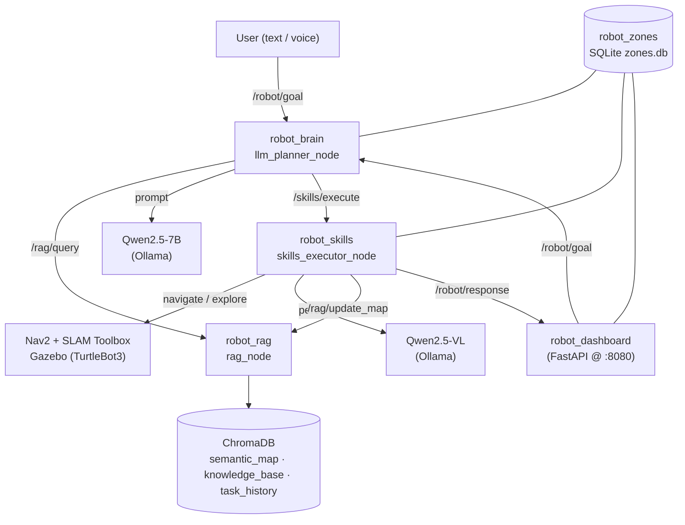

# Robot RAG Agent

A cognitive agent for a mobile robot (TurtleBot3) running in simulation
(ROS 2 Jazzy + Gazebo Harmonic). It takes natural-language goals, consults a
semantic memory (RAG over ChromaDB), plans with a local LLM (Qwen2.5-7B via
Ollama), and executes the plan through ROS 2 skills (navigation, exploration,
perception, reporting). A FastAPI dashboard gives live observability, an
interactive SLAM map, and text/voice goal input.

<!-- Replace <user>/<repo> once pushed to GitHub. -->


> Personal portfolio project. Documentation is treated as first-class: every
> significant decision is recorded as an ADR in [`docs/decisions/`](docs/decisions).

---

## Does the RAG actually help? (measured)

The central question of this project is whether semantic memory (RAG) improves
natural-language navigation. Rather than assert it, it is **measured** with an
ablation: the same tasks are run with RAG on and off, and the planner's
decision is scored. The measurement is at the **planning level** (does the
robot decide to navigate directly to a remembered location, vs. explore
blindly) — this is the causal mechanism of the hypothesis, and it is
reproducible (`temperature=0`), unlike end-to-end navigation on this
software-rendered WSL2 sim (see [ADR-013](docs/decisions/ADR-013-planning-level-benchmark.md)).

**Result** (`eval/tasks_full.yaml`, 30 runs):

| Task type | With RAG | Without RAG |
|---|---|---|
| Object-referenced nav (RAG-dependent) | **9/9 (100%)** | **0/9 (0%)** |
| Known-zone nav (control) | 3/3 (100%) | 3/3 (100%) |
| Impossible goal (hallucination check) | 3/3 (100%) | 3/3 (100%) |


Two more measured findings (full data and charts in
[docs/rag-analysis.md](docs/rag-analysis.md)):

- **Phrasing/language robustness** (36 runs): retrieval survives Spanish
  paraphrases and English goals — 17/18 direct-nav with RAG vs 0/18 without.
- **The embedding model is a real multilingual bottleneck**: with Spanish
  queries over English memories, nomic-embed-text ranks the right document
  first only **43%** of the time (negative separation margin), while
  **bge-m3 reaches 86%** with a positive margin — both stay 100% in English.


How to read this — it is deliberately not "RAG is magic":

- **Object-referenced navigation** ("go to *estacion_a*", a place stored in
  semantic memory): RAG makes all the difference. With it, the planner
  retrieves the coordinates and navigates directly; without it, it has no idea
  where the place is and falls back to exploring.
- **Known-zone navigation** (a place stored in a plain SQLite table): both
  conditions succeed. This control shows the ablation isolates RAG's *object
  memory* specifically — when the information is available another way, RAG is
  not needed. At this scale a lookup would often suffice; RAG earns its keep
  as the remembered vocabulary grows.
- **Impossible goal** ("go to the garage", which does not exist): neither
  condition invents coordinates. RAG does not cause hallucination, and its
  absence does not either.

Reproduce everything (suites, charts, embedding comparison) with
[docs/EVALUATION.md](docs/EVALUATION.md); the full interpretation — when RAG
wins, when plain SQL wins, when an LLM→SQL design would be better — is in
[docs/rag-analysis.md](docs/rag-analysis.md).

---

## Architecture



| Package | Role |
|---------|------|
| `robot_interfaces` | Custom messages/services (`QueryRAG`, `ExecuteSkill`, `UpdateMap`, `SemanticObject`) |
| `robot_rag` | ChromaDB-backed semantic memory + RAG query service |
| `robot_skills` | Executable skills: navigate (Nav2), explore (frontier), perceive (Qwen-VL), report |
| `robot_brain` | LLM planner: RAG retrieval → Qwen plan → skill dispatch → post-execution report |
| `robot_zones` | Shared SQLite store of user-defined named zones |
| `robot_dashboard` | Web dashboard: observability, interactive SLAM map, text/voice goals |
| `robot_bringup` | Launch files and configuration for the whole system |

---

## The cognitive loop

1. A goal arrives on `/robot/goal` (typed, spoken via the dashboard, or `ros2 topic pub`).
2. `llm_planner_node` retrieves relevant context from the three RAG collections
   (dropping low-relevance hits below a similarity threshold) and the known zones.
3. Qwen2.5-7B produces a JSON plan. If retrieved context contains coordinates,
   it navigates directly; otherwise it explores.
4. Skills execute in sequence via `/skills/execute`. Perceived objects are
   written back into semantic memory with their coordinates.
5. A **second** LLM call summarizes the *actual* results (grounded, in the
   user's language) and publishes it to `/robot/response`.

---

## Quickstart

Requires ROS 2 Jazzy, Gazebo Harmonic, and Ollama with `qwen2.5:7b`,
`qwen2.5vl:7b`, and `nomic-embed-text` pulled. See
[`CLAUDE.md`](CLAUDE.md) for the full environment (WSL2 + venv bridge).

```bash
# Prepare the shell (sources ROS 2, bridges the venv via PYTHONPATH — ADR-003)
source ~/robot_ws/setup_env.sh

# Build
cd ~/robot_ws && colcon build --symlink-install

# Launch everything: Gazebo + Nav2 + SLAM + agent + dashboard + RViz
ros2 launch robot_bringup full_system.launch.py

# Send a goal
ros2 topic pub --once /robot/goal std_msgs/String "data: 'Explora el entorno durante 60 segundos'"

# Dashboard (open in the Windows browser): http://localhost:8080
```

---

## Testing & CI

- **Unit tests** (`tests/`): 37 pytest tests over the pure-logic modules — RAG
  chunking, plan parsing, prompt building and language detection, frontier
  selection, the SQLite zone store, and the ChromaDB wrapper. They run without
  a ROS install (`pytest tests/`).
- **Lint**: `ruff check .` (config in `ruff.toml`).
- **CI**: [`.github/workflows/ci.yml`](.github/workflows/ci.yml) runs lint + tests on every push/PR.
- ROS nodes and wiring are exercised locally with `colcon test`.

---

## Tech stack

| Layer | Choice |
|-------|--------|
| Middleware | ROS 2 Jazzy, CycloneDDS (pinned to loopback for WSL2, [ADR-006](docs/decisions/ADR-006-cyclonedds-loopback.md)) |
| Simulation | Gazebo Harmonic, TurtleBot3 Waffle |
| Navigation | Nav2 (SimpleCommander) + SLAM Toolbox ([ADR-004](docs/decisions/ADR-004-slam-toolbox-no-amcl.md)) |
| Planner LLM | Qwen2.5-7B via Ollama (`temperature=0`) |
| Vision | Qwen2.5-VL-7B via Ollama |
| Embeddings | nomic-embed-text via Ollama |
| Vector store | ChromaDB ([ADR-001](docs/decisions/ADR-001-chromadb.md)) |
| Dashboard | FastAPI + uvicorn, vanilla-JS SPA ([ADR-005](docs/decisions/ADR-005-dashboard-fastapi.md)) |

Design decisions are logged as [13 ADRs](docs/decisions/). Highlights:
[ADR-007](docs/decisions/ADR-007-executors-callback-groups.md) (executor/
callback-group design behind the blocking service calls),
[ADR-009](docs/decisions/ADR-009-camera-resolution-bridge.md) (a 1080p camera
silently dropping frames over DDS),
[ADR-011](docs/decisions/ADR-011-rag-quality-zones-sqlite.md) and
[ADR-012](docs/decisions/ADR-012-navigable-rag-post-execution-report.md)
(making the RAG genuinely navigable).

---

## Honest limitations

- **Benchmark is at the planning level, not physical SR/SPL.** End-to-end
  navigation on this WSL2/software-rendered sim is unreliable (the robot wedges
  in narrow doorways; `navigate` occasionally reports false success). The
  planning-level metric measures the RAG mechanism reproducibly; a physical
  SR/SPL run on better hardware is future work — the end-to-end harness
  (reset-to-home, odometry integration, SPL) is written and ready in
  `eval/run_benchmark.py`'s history.
- **RAG's value is scale-dependent.** For a handful of places, a SQLite lookup
  covers most of it (see the known-zone control). RAG matters as remembered,
  open-vocabulary memory grows.
- **Vision (Qwen2.5-VL) is weak on synthetic renders.** Object detection on
  llvmpipe-rendered frames is unreliable; the benchmark uses stored coordinates
  rather than live perception for this reason.
- **Cross-lingual retrieval is the weak link with the default embedder**
  (Spanish queries vs. English docs: 43% top-1 with nomic-embed-text); a
  relevance threshold filters the noise, and switching to bge-m3 (86%
  measured) is the recommended fix — see
  [docs/rag-analysis.md](docs/rag-analysis.md) §2.4.

## Roadmap

1. **Real agent loop** (replanning from execution feedback) — the jump from
   plan-then-execute to a true agent; expected benchmark improvement and a
   natural next README section.
2. **Native voice phase** (Whisper on the Windows NPU, publishing to
   `/robot/goal`) — the NPU is unreachable from WSL2, so this runs host-side.
3. **Conventional detector** (YOLOv8n) as an alternative/comparison to the
   VL — another cheap comparative table.
4. **SLAM map save/load** (`map_saver_cli`) for reproducible scenarios and a
   physical SR/SPL benchmark run.
5. **Docker/devcontainer** for full reproducibility (kills the "works on my
   WSL2" caveat).

## License

MIT — see [LICENSE](LICENSE).
