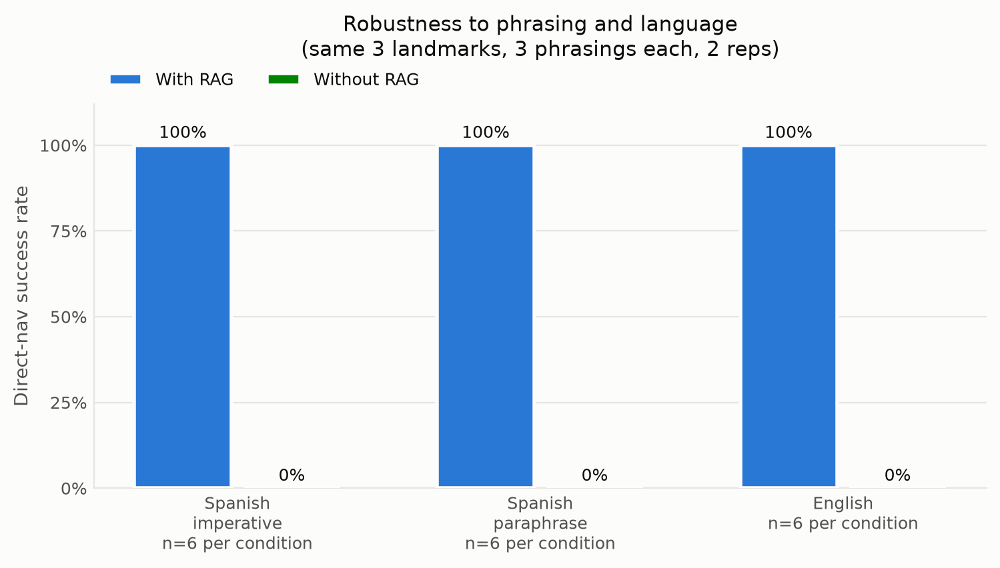
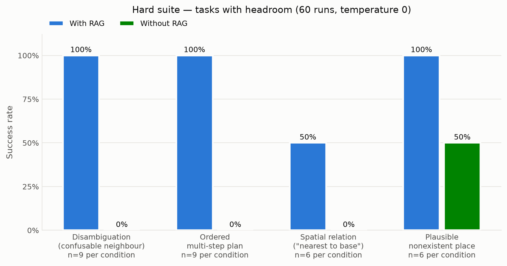
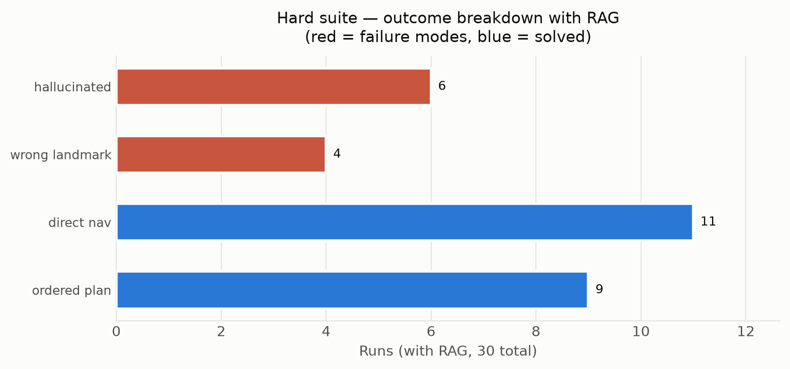
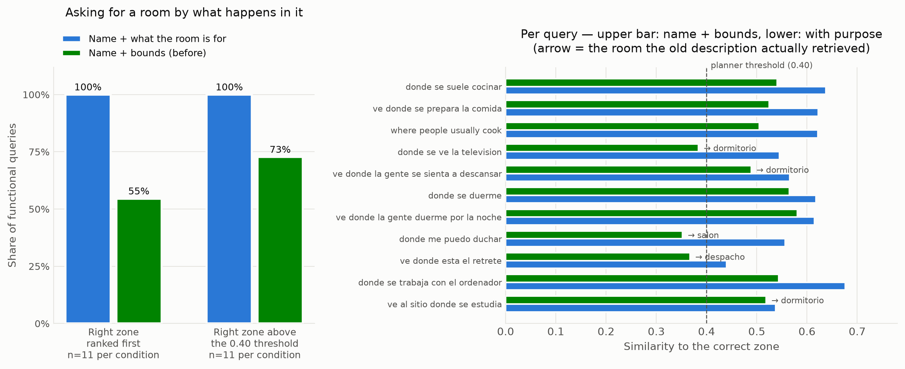

# When does RAG actually help? An evidence-based analysis

This document answers the project's central question with measurements rather
than opinions: **when does a RAG memory improve a robot's natural-language
navigation, when is a plain SQL lookup better, and when would an LLM that
translates language into SQL queries be the right design?**

All numbers come from the reproducible harness in [`eval/`](../eval)
(see [docs/EVALUATION.md](EVALUATION.md) to re-run everything). LLM =
Qwen2.5-7B at `temperature=0`; embeddings = bge-m3 (the project default)
unless stated. The planning suites (§2.1–2.3, §2.6) were **re-measured on
2026-09-16**. The re-run found a regression the July numbers could not show;
§2.8 has the whole account.

---

## 1. The design space

Four architectures can connect "go to the kitchen" to coordinates:

| Design | NL understanding | Recall mechanism | Exactness | Open vocabulary | Infra cost |
|---|---|---|---|---|---|
| **A. Pure SQL lookup** | none (exact string match) | `SELECT ... WHERE name = ?` | perfect | none | trivial |
| **B. LLM → SQL** (text-to-query) | LLM | LLM writes/fills the query | perfect *if* the LLM names the right key | only what the LLM can normalize to a key | LLM only |
| **C. LLM + RAG** | LLM | embedding similarity over stored text | approximate (top-k + threshold) | yes — fuzzy, description-based | LLM + embedder + vector store |
| **D. Hybrid (this project)** | LLM | SQL for named zones **and** RAG for remembered objects | per-store | per-store | both |

A key observation the data will keep confirming: **natural-language
understanding always comes from the LLM, never from RAG.** Designs B, C and D
all let you *talk* to the robot. What RAG uniquely adds is **fuzzy semantic
recall** — retrieving a memory by meaning ("the white fridge", "where you saw
the mailbox") instead of by exact key. If everything you need to recall has a
stable exact name, RAG is overhead.

---

## 2. The evidence

### 2.1 Ablation: RAG on vs off (42 runs)

| Task type | With RAG | Without RAG |
|---|---|---|
| Object-referenced nav (RAG-dependent) | **9/9 (100%)** | **0/9 (0%)** |
| Description-referenced nav (self-built memory) | **6/6 (100%)** | **0/6 (0%)** |
| Known-zone nav (control) | 3/3 (100%) | 3/3 (100%) |
| Impossible goal (hallucination check) | 3/3 (100%) | 3/3 (100%) |

Four findings, one per row:

1. **RAG is decisive exactly where the information lives only in semantic
   memory.** With RAG, the planner retrieves
   `"estacion_a at (x=-1.64, y=-0.37) ..."` and emits
   `navigate(x=-1.64, y=-0.37)` directly, reasoning *"Navigating directly to
   estacion_a since its coordinates are known"*; without it, it has no source
   for the coordinates and falls back to blind exploration (*"no coordinates
   are provided, we need to explore"*). Same goal, opposite plan — the only
   thing that changed is whether the memory was in the prompt.
2. **Description-referenced navigation works on memory the robot built
   itself.** "Ve a la habitación blanca y despejada" resolves against scene
   descriptions (dominant colors + LIDAR clutter, ADR-014) stored
   autonomously while exploring — see §2.5 for what this did to scoring.
3. **The known-zone control proves the ablation isolates RAG, not language
   understanding.** Zone names travel to the planner through SQLite
   (design A embedded inside D), and both conditions score 100%. This is the
   core of the analysis: *for a small closed vocabulary of named
   places, SQL alone is enough* — removing RAG costs nothing there.
4. **For an obviously nonexistent place, RAG neither causes nor prevents
   hallucination.** Asked for "el garaje", both conditions explore instead of
   inventing coordinates. The prompt rules carry that behaviour, and they only
   hold while the knowledge base agrees with them. A worked example that said
   "do not explore" dropped this row to 0/3 with RAG (§2.8). A *plausible*
   nonexistent place is a different story, and RAG makes it worse (§2.6).

### 2.2 Robustness to phrasing and language (36 runs)

Same three landmarks, three phrasings each (Spanish imperative, Spanish
paraphrase, English), two repetitions:

| Phrasing | With RAG | Without RAG |
|---|---|---|
| Spanish imperative ("Ve a estacion_a") | 6/6 | 0/6 |
| Spanish paraphrase ("Llévame hasta donde está...") | 6/6 | 0/6 |
| English ("Take me to...") | 6/6 | 0/6 |

(18/18 with the now-default bge-m3 embedder. An earlier run with
nomic-embed-text scored 17/18 — see the failure dissected below, kept
because it illustrates a real error class.)

This is the practical payoff of the embedding-based recall: **retrieval
survived paraphrase and code-switching** — wordings never seen at indexing
time still ranked the right memory first (landmark names anchor the match;
see §2.4 for how language affects *descriptive* queries).

The single failure observed in the nomic-era run is instructive: for
*"Take me to estacion_c"* the LLM
retrieved the right context but emitted `navigate(zone="estacion_c")` —
misclassifying the remembered object as a named zone. Execution would fail
(no such zone in SQLite), and the scorer correctly counts it as a failure.
Lesson: **even with perfect retrieval, the LLM's interpretation layer is a
real error source** — plan validation against the actual stores (design D's
exactness) is what catches it.

### 2.3 What does RAG cost? Planning latency

Median goal→plan latency is **2.0 s with RAG vs 1.6 s without** (21 runs per
condition), the bars in the right panel of the benchmark figure. The means
are 2.4 s vs 1.5 s. The RAG mean carries one 11.2 s outlier (the ▲ above the
axis), the very first goal after launch. It is a cold start: both re-runs showed it, 11.2 s and 12.6 s, and
every later goal took about 2 s. Retrieval — three collection queries through
`/rag/query`, each a bge-m3 embedding call plus a vector search — costs
**~0.4 s**, small next to the 7B model's inference either way. The phrasing
suite (2.0 vs 1.6 s) and the hard suite (2.5 vs 1.9 s, timeouts excluded) agree.
(With the lighter nomic-embed-text the difference was unmeasurable at ~1.4 s in
both conditions; bge-m3's 1024-dim embeddings are the price of its multilingual
accuracy. RAG's other costs are operational: an embedder, a vector store, and
index freshness.)

### 2.4 Embedding choice: the multilingual gap is real and large

Measured on the project's own corpus (English documents, as the robot stores
them), 7 queries per language, top-1 accuracy and the margin between the
correct document's score and the best wrong one:

| Model | Query lang | Top-1 | Mean correct score | Mean margin |
|---|---|---|---|---|
| nomic-embed-text | Spanish | **43%** | 0.505 | **−0.045** |
| nomic-embed-text | English | 100% | 0.735 | +0.141 |
| bge-m3 | Spanish | **86%** | 0.591 | **+0.080** |
| bge-m3 | English | 100% | 0.639 | +0.126 |

- With **nomic-embed-text**, Spanish queries against English memories are a
  coin flip (43%), and the *negative* mean margin means the wrong document
  outranks the right one on average. This is why the relevance threshold
  (`rag_score_threshold=0.45`, ADR-011) was needed: correct matches measured
  0.57–0.62 while wrong-topic matches reached 0.40 — the threshold cuts the
  noise, at the price of sometimes retrieving nothing for Spanish.
- **bge-m3 doubles Spanish top-1 (43%→86%) and flips the margin positive**,
  while remaining perfect in English. Its English margins are slightly
  smaller than nomic's (+0.126 vs +0.141) — the one trade-off.

**Recommendation — adopted:** `bge-m3` is now the project default
(`embedding_model` in `agent_params.yaml`; collections re-ingested, and
`rag_score_threshold` recalibrated from 0.45 to 0.40 because bge-m3's
correct-match scores center lower — the threshold acts as a noise floor and
top-k disambiguation is the LLM's job). For English-only corpora and queries,
nomic-embed-text remains marginally sharper and smaller.

### 2.5 Self-built memory changes what "the right answer" means

The attribute tasks surfaced a finding worth its own section. The robot now
stores a scene description of every place it reaches while exploring
(ADR-014) — so by benchmark time, the memory contained both the two *seeded*
descriptors and several *self-collected* ones ("area at (x=3.62, y=0.78):
predominantly brown and gray, a moderately furnished space (3 obstacle groups
nearby)").

On the first run, "Llévame a donde había muchos objetos" scored 0/3 — not
because the robot failed, but because it navigated to a **genuinely cluttered
area it had memorized on its own** instead of the one the benchmark seeded.
The plan's reasoning was correct ("the context mentions an area with many
objects, navigate directly to it"); the scorer's single-target assumption was
wrong.

The scorer now accepts a navigate step landing on **any retrieved area whose
stored description matches the task's attribute terms** (the planner chooses
among exactly those retrieved documents). With that correction: 6/6.

Two lessons: (1) with an autonomously growing memory, descriptive goals stop
having a unique ground truth — evaluation must define success as *"a place
that satisfies the description"*, not *"the place I planted"*; (2) this is
also the strongest evidence in the whole benchmark that the self-building
pipeline works end-to-end: explore → describe → store → retrieve → navigate,
with no human in the loop.

### 2.6 A harder suite, because the main one is saturated

Every cell of §2.1 is 100% or 0%. That is a clean result, but a saturated
one: it cannot measure an *improvement*, so it is useless for the roadmap's
next step (a replanning agent loop would score identically). `tasks_hard.yaml`
(60 runs, `seed_memory.py --hard`) exists to have headroom — tasks built to be
failable by the current plan-then-execute system.

| Task type | With RAG | Without RAG |
|---|---|---|
| Disambiguation (name-confusable neighbour) | **9/9** | 0/9 |
| Ordered multi-step plan | **9/9** | 0/9 |
| Spatial relation ("nearest to base") | **2/6** | 0/6 |
| Plausible nonexistent place | **0/6** | 3/6 |

The suite does what it was meant to do: it leaves room to improve, and the
*decision* labels say where. It also found a weakness the July run did not
show:

- **Disambiguation is solved.** Retrieval returns both `estacion_a` and
  `estacion_a_norte`; the planner picks the requested one 9/9 and never hedges
  by visiting both. Semantic memory plus a name is enough here.
- **Ordered multi-step is solved** (9/9) — "go to A, look around, then go to C"
  comes back as `navigate(A) → scan_360 → navigate(C)`, in order.
- **Spatial reasoning is a real gap: 2/6.** "Go to the station *nearest the
  base zone*" needs the planner to compare retrieved coordinates, not just copy
  one. It fails 3/3 on "nearest" and 1/3 on "farthest". Every miss goes to
  `estacion_a`: the planner retrieves the right candidates and skips the
  distance arithmetic. (July: 3/6. One run of difference is within run-to-run
  variation, §2.8.)
- **With RAG, the planner borrows coordinates for places that do not exist:
  0/6.** "Ve a estacion_d" explores and then navigates to `estacion_a`. "Ve a
  la estación central" goes straight to `estacion_a`, reasoning that it "has
  known coordinates". Without RAG the bare LLM gets 3/6: it explores for
  "estación central" and invents a position for `estacion_d`. The memory hands
  the planner real coordinates, and the planner uses them for the wrong name.
  Operationally that is worse than an invented point: the robot drives
  confidently to a real place that is not the one asked for.

  **This withdraws a July claim.** The July run scored this row 6/6 vs 3/6, and
  this section read it as evidence that RAG *suppresses* hallucination. On the
  current system it does not, and the claim is gone. Where the difference comes
  from is not established: in a replay that held everything else fixed, the July
  knowledge files declined one of the two goals but not the other (§2.8,
  [ADR-031](decisions/ADR-031-knowledge-base-is-planner-input.md)).

With RAG the failures are `wrong_landmark` (4 runs, the spatial-relation tasks)
and `hallucinated` (6 runs, the plausible nonexistent places). Both are a
correct retrieval followed by a wrong choice among the retrieved coordinates,
the kind of error that checking a plan against memory, or an agent loop that
verifies its target, is meant to catch.

### 2.7 What a zone is *called* vs what it is *for*

A zone was stored as its name plus a bounding box, which answers "ve a la
cocina" and fails "ve donde se suele cocinar" — a goal that names the room's
function and never the room. `eval/room_semantics_bench.py` measures the gap on
five named zones (cocina, salón, dormitorio, baño, despacho) and 11 functional
queries, 9 Spanish and 2 English, with bge-m3:

| Zone description | Top-1 | Above the 0.40 threshold | Mean score of the right zone |
|---|---|---|---|
| Name + bounds (before) | **55%** (6/11) | 8/11 | 0.488 |
| Name + what the room is for (now) | **100%** (11/11) | 11/11 | 0.585 |

The failures are more informative than the average. With only a name to go on,
"donde me puedo duchar" retrieved the **living room**, "ve donde está el
retrete" the **office**, and "ve al sitio donde se estudia" the **bedroom** —
plausible-looking retrievals that would have sent the robot confidently to the
wrong room. All five are fixed by attaching the room's purpose in both
languages ([ADR-022](decisions/ADR-022-room-semantics.md)).

Three queries also sat *below* `rag_score_threshold` before, meaning the correct
zone was not merely outranked — it never entered the prompt at all, and the
planner fell back to exploring.

Verified end to end afterwards, outside the micro-benchmark: with a `cocina`
zone created through the dashboard on a live stack, "ve donde se suele cocinar"
retrieves it at **0.631**, ahead of every landmark in a store of 36 memories —
and, with zone names withheld from the prompt so that only retrieval can supply
the answer, the planner emits `navigate(x=1.75, y=-0.75)`, the zone's center,
reasoning that "the kitchen is identified as the place where meals are cooked".
The same goal with `rag_enabled:=false` falls back to `explore`.

Scope, honestly: this measures retrieval over one small, clean zone set, not
end-to-end task success, and the vocabulary is a fixed table of eleven room
types. It says that a functional query now reaches the right zone; it does not
say the robot understands rooms.

### 2.8 Re-measured two months later: the knowledge base is part of the prompt

The July numbers were measured ten minutes before a commit that rewrote
`data/knowledge/`, and nothing re-measured them afterwards. On 2026-09-16 all
three planning suites were re-run from scratch, in a scratch workspace with a
fresh map and memory:

| Suite, with RAG | July | Run 1 (knowledge as committed) | Run 2 (one template removed) |
|---|---|---|---|
| Full (21 runs) | 21/21 | **18/21** | 21/21 |
| Phrasing (18 runs) | 18/18 | 18/18 | 18/18 |
| Hard (30 runs) | 27/30 | 19/30 | **20/30** |

Without RAG, every run scored the same: 6/21, 0/18, 3/30.

**Run 1** lost the impossible-goal control: for "Ve al garaje" the planner
explored and then navigated to `estacion_a`'s coordinates, 0/3. A replay held
everything fixed except the knowledge files: the same system prompt, the same
live `semantic_map` context, one plan per goal. The replay traced the loss to a
single worked example the rewrite had added: *"if the retrieved context
contains a place whose description matches, navigate straight to it. **Do not
explore.**"* That example contradicts the rule that a place with no known
coordinates must be explored for. The 7B planner followed the example. With it
removed, the replay explored again, and **run 2**, repeated from scratch,
restored 3/3.

A gentler rewrite was tried in the replay first and rejected. It kept the
example, softened to "no need to explore first", and added a negative one ("Ve
al sótano", which no suite contains → explore). It did not fix the garage, and
it broke "Ve a la zona base". Removing the example was the smallest change that
worked. Wording was not iterated further, because the only goals it could be
tuned against are the benchmark's own.

What run 2 did **not** restore is the hard suite's plausible-nonexistent row
(0/6, §2.6). The July knowledge files explain only half of it in the replay,
so the cause is left open rather than guessed. And the store never noticed any
of this: `rag_node` skipped ingestion whenever `knowledge_base` was populated,
so an edited file never reached an existing store. It now re-syncs whenever the
files change.
[ADR-031](decisions/ADR-031-knowledge-base-is-planner-input.md) records the
decision, the rejected fixes and the rule that follows: **an edit to
`data/knowledge/` is a prompt change, and it is followed by a re-run of the
planning suites.** Run 1's raw results are kept in
`eval/results/before-kb-fix-2026-09-16/`.

---

## 3. Interpretation: choosing a design

**Use pure SQL (A) when** the recall vocabulary is small, closed, and
exactly named — like this project's user-defined zones. The control row shows
zero benefit from RAG there. No embedder, no index, perfect precision.

**Use LLM → SQL (B) when** the data is *structured* and the questions are
*exact or aggregative*: "how many chairs did you log yesterday?", "which zone
did you visit last?". Text-to-query gives perfect answers over keys and
numbers — things embedding similarity is bad at. Its weakness is fuzzy
reference: the LLM must normalize "esa cosa blanca de la cocina" to a key it
has never seen, with no similarity signal to help. (Worth noting: B puts the
LLM *inside* the retrieval path, so recall quality depends on model
temperature/version; C's retrieval is deterministic given the index.)

**Use LLM + RAG (C) when** memories are open-vocabulary and described rather
than named: objects the camera saw ("a black mailbox on a pole"), places
characterized by free text. §2.2 shows the recall surviving phrasings no
lookup could match. This is also the design that scales with memory size:
at 3 landmarks a human could hand-check, at 10,000 perception memories
similarity search is the only recall that still works.

**The hybrid (D, this project) is not indecision — it is putting each store
where it wins.** Exact things (zones) resolve through SQL and are immune to
retrieval noise; fuzzy things (perceived objects) resolve through RAG; the
LLM supplies language understanding over both, and the exact store at least
refuses a zone name it does not hold (§2.2). The measured failure modes map
onto three sources: cross-lingual embedding weakness (→ fixed by bge-m3), a
knowledge-base example contradicting the prompt rules (→ removed, §2.8), and
the LLM's interpretation of correct context — a wrong reference type, a skipped
distance comparison, coordinates borrowed for a nonexistent place (§2.6). None
came from the hybrid structure itself. The third is still open: plans are not
checked against memory before they run.

### Threats to validity (read before quoting the numbers)

- Measured at the **planning level** (ADR-013), not physical execution; the
  claim is about *decisions*, which is the mechanism RAG can influence.
- Small task suite and corpus (138 planning runs, 28 embedding queries, 11
  zone queries) on one LLM, **one run per condition**.
- **`temperature=0` does not make results exact.** Repetitions inside a run
  occasionally differ ("farthest from base" 2 of 3), and across two runs of the
  same suite a task type moved by one or two runs. Read a difference that small
  as noise, not as an effect (§2.8).
- **The results depend on the knowledge base as much as on the code.** Worked
  examples in `data/knowledge/` are part of the prompt; one of them cost the
  impossible-goal control 3/3 → 0/3 (§2.8). Numbers are valid for the
  knowledge files they were measured with.
- The failing benchmark goals were used to *diagnose* that regression. They
  were not written into the knowledge base, and the final files were measured
  once, not iterated until the score recovered.
- Landmark tasks use the landmark's *name* in the goal, which favors
  retrieval; the embedding study (§2.4) covers the harder descriptive-query
  case where the multilingual gap appears.

---

## 4. Actionable conclusions

1. **Keep the hybrid.** SQL for named zones, RAG for perceived/described
   memories, LLM as the language layer. Each is measurably doing the job the
   others can't.
2. **Switch to bge-m3 for multilingual use** — the single highest-leverage
   change the data supports (43%→86% Spanish top-1). *Adopted as the
   project default.*
3. **Keep the relevance threshold** while any cross-lingual traffic exists;
   re-calibrate it after an embedder change (score distributions shift:
   bge-m3's correct-match scores center lower, ~0.59 vs 0.74 — the default
   moved from 0.45 to 0.40 accordingly).
4. **Validate plans against the exact stores and the retrieved memory.** Even
   with perfect context, the LLM will emit the wrong reference type (§2.2),
   skip a distance comparison, or reuse a real place's coordinates for a
   name no memory holds (§2.6, 0/6). Today nothing checks the plan before it
   runs: this is the highest-value fix the hard suite points at.
5. For future structured queries over task history ("what did you do
   yesterday?"), add a **text-to-SQL path (B)** rather than stretching RAG
   into aggregation questions it cannot answer.
6. **Treat `data/knowledge/` as prompt, not documentation.** A worked example
   can override a rule. Re-run the planning suites after every edit, and read
   the numbers as valid for the knowledge files they were measured with (§2.8,
   ADR-031).
